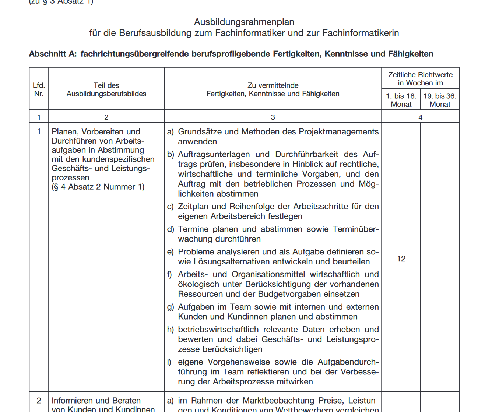

# Betriebliche Ausbildungspläne erstellen

## Ausbildungsverordnung
Wenn es eine solche gibt, entsteht ein Schutz für diese Berufsbezeichnung. Man darf sich nur so nennen wenn man die entsprechenden qualifikationen hat etc.

Es gibt 2 neuerungen in Berufen in denen die Verordnung neu geordnet werden:

* "Berichtsheft" heißt jetzt "Ausbildungsnachweis"
* Es gibt meistens keine "Zwischenprüfung" mehr, sondern eine "gestreckte Aschlussprüfung" (Prüfung Teil 1 & Prüfung Teil 2). Der Unterschied ist, dass in einer gestreckten Abschlussprüfung das Ergebnis des ersten Teils in die Endnote einfliest.

Der §5 der Verodnung definiert den Ausbildungsrahmenplan.

§10 definiert die Bestehensregelung. Also z.B. wenn gewisse Teilbereiche make-or-break sind.

Hier werden der deutschlandsweite Standart gesetzt. Ausbilder oder Ausbildende müssen bei der Anmeldung zur Prüfung bestätigen, dass die Lerninhalte aus dem Rahmenplan vermittelt wurden. 

> Wenn wir das nicht tun kann es rechtliche Konsequenzen haben. Auszubildende könnte sich beschweren, was bedeutet dass der Ausbildungsberater der IHK das Berichtsheft haben und kontrollieren will. Ist das nicht gepflegt und landet es vor gericht, hat es Konsequenzen für den Auszubildenden: Schaden durch späteres volles Gehalt, schaden durch fehlende Rentenpunkte, schaden durch negativmerkmal im Lebenslauf. In Summe kann das 45.000€ kosten. Schaden und Schuldiger in kombination sehr ungünstig. Die Handwerkskammer fordert den Ausbildungsnachweis bei Prüfungen immer, die Handelskammer nicht.

Die Berufsschule ist in der Betrachtung außen vor, da dieser Vertrag zwischen Kammer und Unternehmen geschlossen ist. Das Unternehmen muss bei der Berufsschule die Vermittlung des Rahmenlehrplans kontrollieren. 

## Ausbildungsrahmenplan

Das, was das Unternehmen unterrichten muss

* Spalte 1: Nummer
* Spalte 2: Richtlernziel
* Spalte 3: Groblernziel
* ggf. zusätzliche Spalten

> Prüfungsfrage
>
> Welche Ziele können sie dem Rahmenplan entnehmen?
>
> Antwort: Richtziele und Groblernziele



Feinlernziele müssen in dem Betrieb definiert werden.

## Ausbildungsrahmenlehrplan

Das was die Berufsschule unterrichten muss

* Lernfelder


Ländersache (die Prüfung aber nicht)

## Betrieblicher Ausbildungsplan

Muss erstellt werden. Es gibt aber Entwürfe seitens der IHK.


```
   Rahmenlehrplan
+  Ausbildungsrahmenplan
+  Betriebliche Belange und Möglichkeiten
   ---------------------
   Betrieblicher Ausbildungsplan
```

Der Betriebliche Ausbildungsplan ist Vertragsbestandteil. Dementsprechend muss er den Auszubildenden zu Beginn ausgehändigt werden.

## Individueller Ausbildungsplan

Beispiel: 3 Azubis. Einer mit Abi, einer Realschule und einer mit schlechtem Realschulabschlus. Dementsprechend ein Abschluss in 2,5 3 oder 3,5 Jahren.
Vielleicht ein talentierter Studienabbrecher?

```
   Betrieblicher Ausbildungsplan
+  Betriebliche Einflusfaktoren (z.B. Saisonale Effekte)
+  Einflussfaktoren Azubi (z.B. Vorbildung)
   ---------------------
   Individueller Ausbildungsplan
```

Hier könnten auch Zusatzqualifikationen hinzugefügt werden falls jemand ein Überflieger ist. Dieser Plan ist aber nicht vorgeschrieben

Auf der anderen Seite gibt es auch Lernbeeinträchtigungen (medizinisch), Teilzeit, Mutterschutz, Krankheit, etc. Die Berufsschulen sind aber leider nicht gut auf diese flexibilität aufgestellt.

Verkürzungen können wie folgt zum Vertragsabschluss angegeben werden und müssen von der IHK genehmigt werden. `BBiG §8, §21`

* Mit Abitur: -1 Jahr
* Realschule: -0,5 Jahre
* Vor-Ausbildung (Umzug o.ä.) kann auch ohne IHK genehmigt werden (entsprechend Anteilig). Es muss aber in den Prüfungsrythmus passen (also halbjährlich abrunden)
* Umschulungen: -1 Jahr (Leider eine Kostensparmaßnahme die in der praxis weniger Sinn ergibt)

DIHK verkauft alte Prüfungen. Jeder IHK Ausbildung kann autodidaktisch abgeschlossen werden, wenn man über die fachliche Eignung verfügt (siehe Tag 1 Betriebliche Eignung). Ein betreibswirt kostet über 1000€ Prüfungsgebühren

Betriebswechsel sind prinzipiell möglich, wenn der neue Betrieb das akzeptiert und man in den 3-Jahres-Rhytmus rein passt. Ist aber ein kleines Ü-Ei ob der Azubi tatsächlich kann was er können sollte

