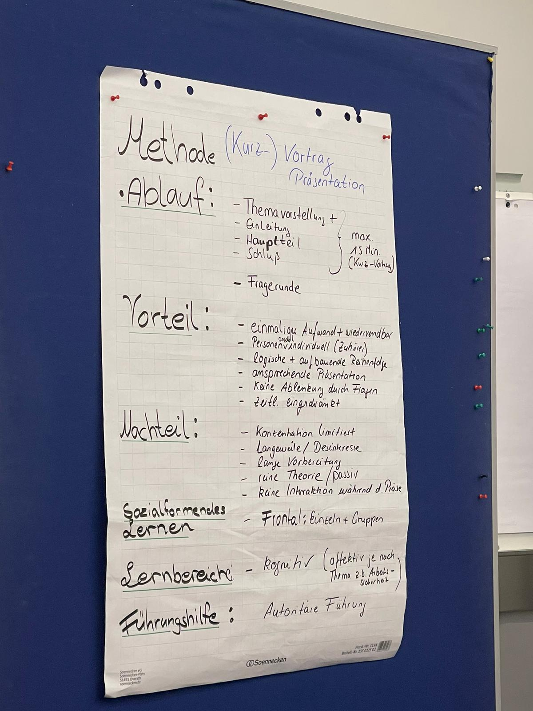
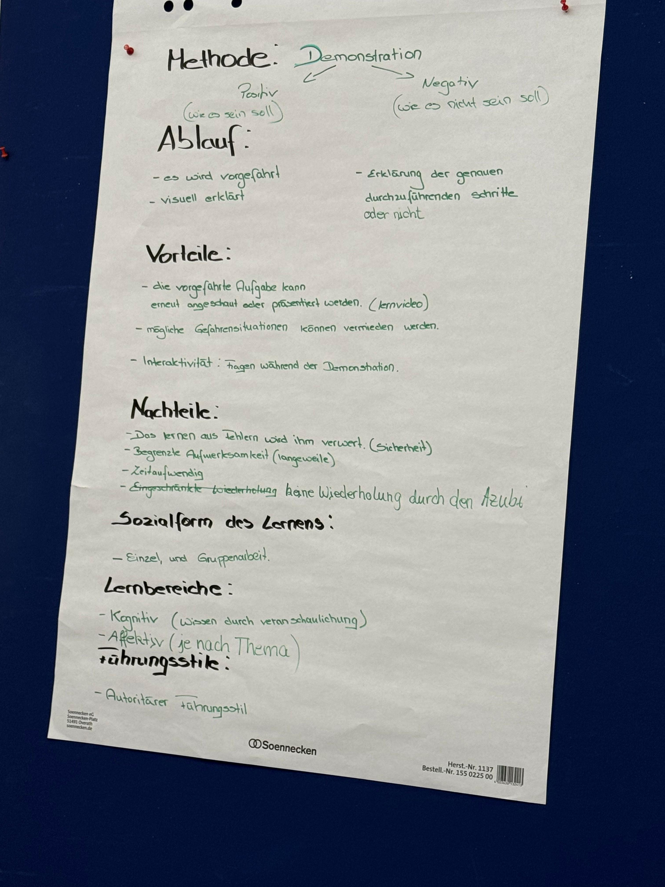
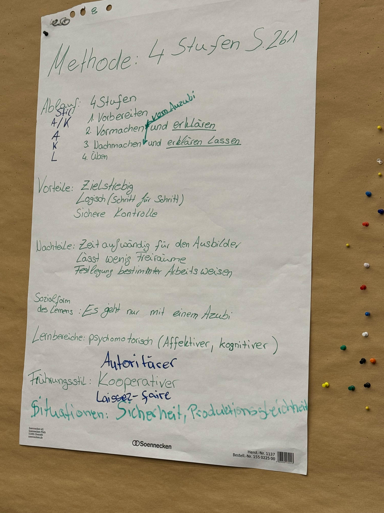

# Dateneckblatt

S.479 im Ordner

* Name, Vorname, etc.
* Ausbildungssituation wird **praktisch durchgeführt**

* Thema: 1:1 das Feinlernziel oder zusammengefasst
* Ausbildungsberuf: ...
* Zielgruppe:
  * ein Auszubildender
  * erstes Ausbildungsjahr, fünte Monat
  * Mittlerer Bildungsabschluss
  * 17 Jahre alt
  * Engagiert, neugierig
  * Auditiver Lerntyp (Adressatenanalyse)
* Geplanter Ablauf
  * Richtlernziel
  * Groblernziel
  * Feinlernziel
  * Methode
    * Ablauf
    * Vorteil
    * Nachteil
    * Sozialformendes Lernen
    * Lernbereiche
    * Führungsstile(?)

# Lernmethoden

## Kurzvorträge / Präsentation

Seitens des Ausbilders. Könnte aber auch umgedreht werden (der Azubi präsentiert)

### Ablauf
maximal 15min

* Einleitung
* Haupteil
* Schluss

ggf. Fragerunde

### Voteil

* Einmal erstellt, kann man die PPT immer wieder verwenden
* Es ist egal ob 1 oder 50 zuhören (skaliert)
* Logische Reihenfolge / Struktur aufbereitet
* gute möglichkeiten zur Visualisierung
* Keine Ablenkung durch Fragen
* Zeitliche Einschränkung

### Nahcteiul
Konzentrationsmangel
Info sammeln dauert lange
Reine Theorie 
Keine Interaktion (passiv)

### Sozialform

Frontalmethode
Einzeln und in Gruppen

### Lernbereich

Kognitiv
Affektiv (Arbeitsschuhe)

#### Führungsstile

Autoritär

### Anwendungsgebiet

Vieles, hauptsächlich Kognitives

## Demonstration

Entweder:
* Positiv (Wie es sein sollte)
* Z.B. Eingedeckter Tisch im Restaurant

Oder:
* Negativ (Wie es nicht sein soll)
* Z.B. Gabelstapler fahrer Klaus

### Ablauf

* es wird vorgeführt
* Visuell dargestellt
* Ausbilder kann währenddessen erklären wie man etwas mach (oder nicht macht)

### Vorteil

* Aufgabe kann mehrfach ausgeführt werden
* Bei Gefahrensituationen kann Gefahr vermieden werden
* Interaktivität / fragen während der dem demonstrieren

### Nachteil

* Kein Learning by doing (z.B. bei Sicherheitsaspekten)
* Begrenzte Aufmerksamkeit
* Sehr zeitaufwendig zu demonstrieren
* Keine Wiederholung durch den Azubi möglich

### Sozielform

Einzel und Gruppenarbeit (je nach Anwendungsgebiet)

### Lernbereiche

* Kognitiv (Veranschaulichend)
* Affektiv (je nach Thema)

### Führungsstil

Autoritär

### Anwendungsgebiet

Viele

## 4-Stufen Methode

### Ablauf

4 Stufen:

* Vorbereiten
* Vormachen
* Nachmachen und vom Azubi erklären lassen
* Azubi übt eigenständig

### Vorteil

* Zielstrebig
* Logisch Lernschritte können gut aufgeteilt werden
* Sichere Kontrolle

### Nachteil

* Zeitaufwendig durch Betreuungsaufwand
* Lässt wenig Freiräume in dem was er machen soll
* Legt bestimmte Arbeitsweisen fest

### Sozielform

einzeln.
Skaliert nicht

### Lernbereiche

Fokus: Physiomotorisch

Affektive
Kognitive 

### Führungsstil

Stufe | Stil 
------|-------
1     | Autoritär / Kooperativ
2     | Autoritär
3     | Kooperativ
4     | Laissez-Faire

**Punkt 3 ist die Lernkontrolle**, daher Kooperativ!

* Das "Erklären lassen" zeigt dass er es wirklich verstanden hat, und nicht nur dumpf nachmacht!
* "Was ist der Unterschied zwischen anlernen und ausbilden"? -> Antwort: Beim ausbilden weiß der Azubi warum er etwas macht.

### Anwendungsgebiet
* Praktisches Thema
* Sicherheitsrelevant oder Produktionsgleichheit (Wirtschaftlich kritisch)

## 5

### Ablauf

### Vorteil

### Nachteil

### Sozielform

### Lernbereiche

### Führungsstil

## 6

## 7

## 8

## 9

## 10

### Ablauf

### Vorteil

### Nachteil

### Sozielform

### Lernbereiche

### Führungsstil

## 1 Projektmethode

Im Ablauf die 6 Phasen

"Projektarbeit"

Es gibt eine _komplexe_ Zielsetzung, die die Auszubildenden sich selber erarbeiten. Am Ende steht ein erfolgreiches Projekt.

Ein Projekt kann so ziemlich alles sein. Sommerfest, Seifenkisten, Stadtbrunnen-Design.

* Projekt: Zielgerichtetes, einmaliges Vorhaben, das aus einem Satz von abgestimmten, gesteuerten Tätigkeiten besteht und durchgeführt werden kann
  * Immer komplex & einzigartiges
  * Eine Reale Aufgabenstellung
  * Start/Endzeitpunkt
  * ggf 1 oder mehr Azubis

  Welche Rolle hat der Auzubi, welcher der Ausbilder

-------

3 Azubis: (je 1 pro Lehrjahr)
Azubis sollen alle vorbereitungen treffen um einen Stand am Weihnachtsmarkt haben zu können.

### Ablauf

1. Informieren
   1. Ausbilder: Aufgabenstellung vermitteln (Wir wollen einen Stand am Weihnachtsmarkt), Informationen kontrollieren
   2. Auzubildende: Sammeln Informationen
2. Planen
   1. Auzubildende: Erstellen den Plan, wann was gemacht werden muss
   2. Ausbilder: Beobachten
3. Entscheiden
   1. Auzubildende: Abwägen von verschiedenen Optionen
   2. Ausbilder: Wann, wo, Deko, Abnahme des Plans, Risiko-Management
4. Ausführen
   1. Auzubildende: Führen aus
   2. Ausbilder: Beobachtet, Verantwortung (Pausenzeiten)
5. Kontrollieren
   1. Auzubildende: Bestandskontrolle, Kassenabrechnung, Hat's gereicht? Gespräche?
   2. Ausbilder: Beraten & beobachten
6. Bewerten
   1. Auszubildende: Bewerten sich selber, good bad and the ugly, schlussfolgerungen
   2. Ausbilder: Loben, Bespricht Ergebnisse, bestätigt oder korrigiert Selbstbewertung

### Vorteil

* Gemeinschaftliches ausarbeiten / Teambuilding
* Motivation durch Selbsständigkeit und Gestalltungsspielraum
* Hinarbeitung aud ein sichtbares Ergebnis

###  Nachteil

* Konflikte im Team / Unstimmigkeiten möglich
* Benötigt sehr eigenständige Azubis
* Gefahr dass nur einer was macht

### Sozialform des Lernen

* Gruppenarbeit

### Lernbereiche

* Kognitiv: Zeitraum, Regeln, Projektmanagement, ...
* Affektiv: Wirtschaftliches Denken, Selbstständigkeit, Sorgfalt(!)

### Führungsstile

Hauptsächlich Laissez-Faire
(in kritischen bereichen auch anders)

