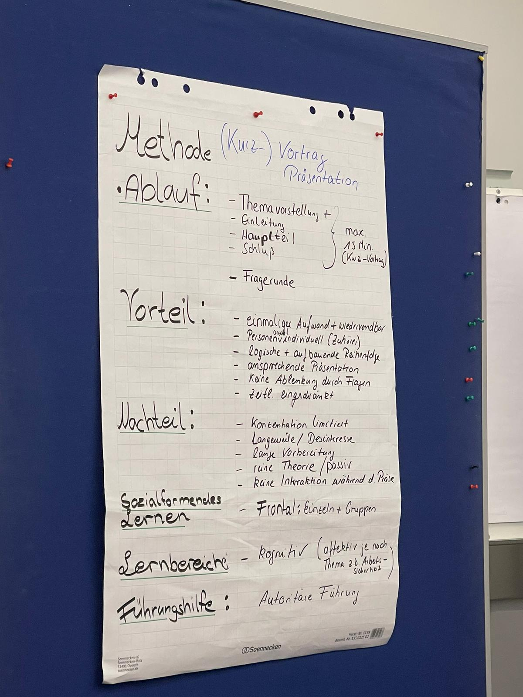
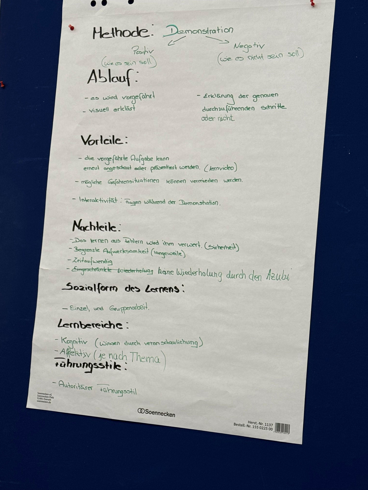
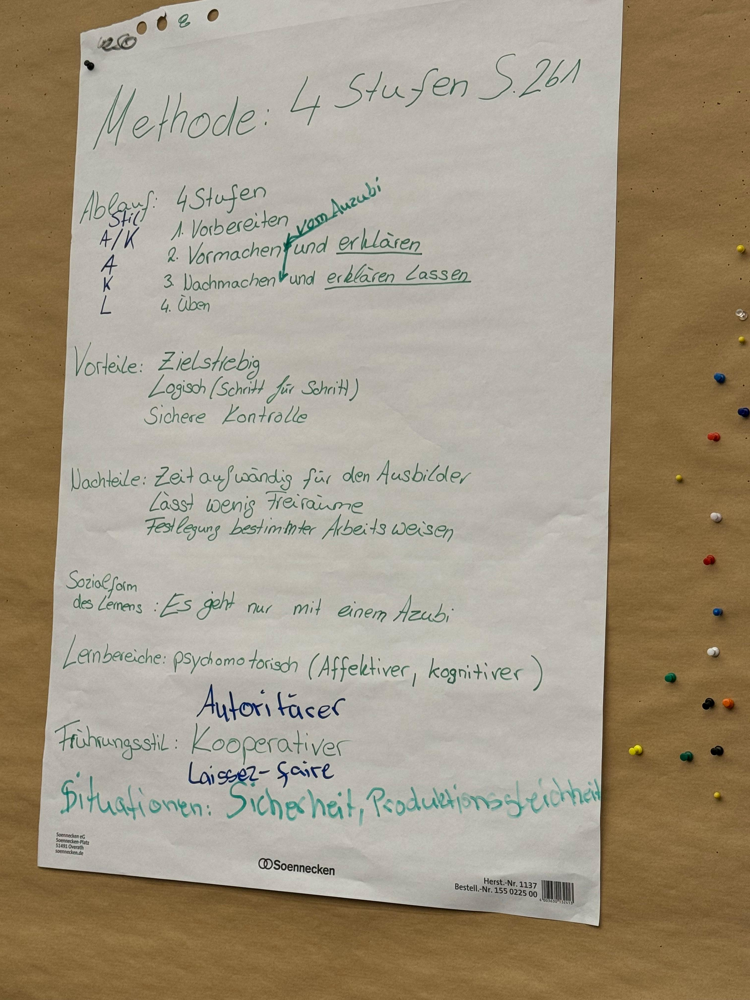

# Dateneckblatt

S.479 im Ordner

* Name, Vorname, etc.
* Ausbildungssituation wird **praktisch durchgeführt**

* Thema: 1:1 das Feinlernziel oder zusammengefasst
* Ausbildungsberuf: ...
* Zielgruppe:
  * ein Auszubildender
  * erstes Ausbildungsjahr, fünte Monat
  * Mittlerer Bildungsabschluss
  * 17 Jahre alt
  * Engagiert, neugierig
  * Auditiver Lerntyp (Adressatenanalyse)
* Geplanter Ablauf
  * Richtlernziel
  * Groblernziel
  * Feinlernziel
  * Methode
    * Ablauf
    * Vorteil
    * Nachteil
    * Sozialformendes Lernen
    * Lernbereiche
    * Führungsstile(?)

# Lernmethoden

## Überblick

* Kurzvorträge / Präsentation
* Demonstration
* 4-Stufen Methode
* Diskussion
* Brainstorming
* Fragend-Entwickelndes Lehr-Lern-Gespräch

## Kurzvorträge / Präsentation

Seitens des Ausbilders. Könnte aber auch umgedreht werden (der Azubi präsentiert)

### Ablauf
maximal 15min

* Einleitung
* Haupteil
* Schluss

ggf. Fragerunde

### Voteil

* Einmal erstellt, kann man die PPT immer wieder verwenden
* Es ist egal ob 1 oder 50 zuhören (skaliert)
* Logische Reihenfolge / Struktur aufbereitet
* gute möglichkeiten zur Visualisierung
* Keine Ablenkung durch Fragen
* Zeitliche Einschränkung

### Nahcteiul
Konzentrationsmangel
Info sammeln dauert lange
Reine Theorie 
Keine Interaktion (passiv)

### Sozialform

Frontalmethode
Einzeln und in Gruppen

### Lernbereich

Kognitiv
Affektiv (Arbeitsschuhe)

#### Führungsstile

Autoritär

### Anwendungsgebiet

Vieles, hauptsächlich Kognitives

## Demonstration

Entweder:
* Positiv (Wie es sein sollte)
* Z.B. Eingedeckter Tisch im Restaurant

Oder:
* Negativ (Wie es nicht sein soll)
* Z.B. Gabelstapler fahrer Klaus

### Ablauf

* es wird vorgeführt
* Visuell dargestellt
* Ausbilder kann währenddessen erklären wie man etwas mach (oder nicht macht)

### Vorteil

* Aufgabe kann mehrfach ausgeführt werden
* Bei Gefahrensituationen kann Gefahr vermieden werden
* Interaktivität / fragen während der dem demonstrieren

### Nachteil

* Kein Learning by doing (z.B. bei Sicherheitsaspekten)
* Begrenzte Aufmerksamkeit (keine "Aktivierung")
* Sehr zeitaufwendig zu demonstrieren
* Keine Wiederholung durch den Azubi möglich

### Sozielform

Einzel und Gruppenarbeit (je nach Anwendungsgebiet)

### Lernbereiche

* Kognitiv (Veranschaulichend)
* Affektiv (je nach Thema)

### Führungsstil

Autoritär

### Anwendungsgebiet

Viele

## 4-Stufen Methode

### Ablauf

4 Stufen:

* Vorbereiten
* Vormachen
* Nachmachen und vom Azubi erklären lassen
* Azubi übt eigenständig

Nichts weg lassen! Ansonsten ist es keine 4-Stufen-Methode

### Vorteil

* Zielstrebig
* Logisch Lernschritte können gut aufgeteilt werden
* Sichere Kontrolle

### Nachteil

* Zeitaufwendig durch Betreuungsaufwand
* Lässt wenig Freiräume in dem was er machen soll
* Legt bestimmte Arbeitsweisen fest

### Sozielform

einzeln.
Skaliert nicht

### Lernbereiche

Fokus: Physiomotorisch

Affektive
Kognitive 

### Führungsstil

Stufe | Stil 
------|-------
1     | Autoritär / Kooperativ
2     | Autoritär
3     | Kooperativ
4     | Laissez-Faire

**Punkt 3 ist die Lernkontrolle**, daher Kooperativ!

* Das "Erklären lassen" zeigt dass er es wirklich verstanden hat, und nicht nur dumpf nachmacht!
* "Was ist der Unterschied zwischen anlernen und ausbilden"? -> Antwort: Beim ausbilden weiß der Azubi warum er etwas macht.

### Anwendungsgebiet
* Praktisches Thema
* Sicherheitsrelevant oder Produktionsgleichheit (Wirtschaftlich kritisch)

## Diskussion

Diskussion = "Austausch von..."
Es muss nicht zwingend ein einzelnes Ergebnis sein (sokrates style), sondern es kann auch ein "Agree to disgree" am Ende stehen.

### Ablauf

* Gruppendiskussion zu einem vorgegebenen Thema
* Ausbilder zieht sich zurück (und moderiert/setzt impulse nur falls nötig)

### Vorteil

* Anregung zum selstständigen Arbeiten
* Lernen ruhe zu bewahren und sachlich zu bleiben
* lernen kompetenzen zu entwickeln und steigern
* Prägt sich besser ein als Frontaluntericht

### Nachteil

* Introvertierte Charactere ziehen sich ggf. zurück
* Desintressierte nehmen nichts mit
* Desintressierte haben am Gruppenergebnis Teil ohne was zu tun

### Sozielform

Gruppenarbeit

### Lernbereiche

Kognitiv
Je nach Thema auch Affektiv

### Führungsstil

Laissez-Faire, ggf. Kooperativ wenn notwendig

### Anwendungsgebiet

Viele

Kontroverse Themen

Themen die die Azubis direkt betreffen (z.B. JAV gründen ja/nein?)

Gut um in eine Beobachterrolle zu gehen (Early-Talent bestimmung)

## Brainstorming

"Gedanken aufwirbeln"

### Ablauf

* Moderator erläutert ein Problem oder eine Aufgabe
* Teilnehmer nennen ideen die ggf. festgehalten werden
* Ideen werden nicht bewertet
* Kann zwischen 1min und 30min gestrecht werden

### Vorteil

* Viele Ideen kommen zusammen
* Azubis trauen sich ausergewöhnliche Ideen zu sagen, gehen ggf aus siche heraus
* Neue Assoziationen können entstehen, erweiterung des Horizonts
* Eine Methode die relativ viel spaß macht
* Eine Einfahe Methode, die spontan anwendbar ist (null Aufwand) "was fällt dir dazu ein".

### Nachteil

* Zu viele IDeen sind unübersichtlich (die quantität steht über der qualität)
* Extrovertierte Azubis können introvertierte überdecken

### Sozielform

* Einzel, partner und Gruppenarbeit

### Lernbereiche

* Kognitiv
* Affektiv (je nach Thema)

### Führungsstil

* Laissez-Faire
* Kooperativ

### Anwendungsgebiet

* Blockaden lösen
* Startpunkt für ein Thema (gefolgt von clustern der Ideen, ergebnisse durchgehen etc.)
* Kontrolle von gelerntem aus der Vergangenheit
  * Differenzierung zur Präsentation: "Sag mal, was haben wir letzte Woche so gemacht?" deutlich besser als selber zusammenzufassen. ("Aktivierung")

## Fragend-Entwickelndes Lehr-Lern-Gespräch

In den Büchern steht das meistens: "Fragend Entwickelnde Methode" oder "Lehr-Gespräch". "Lehrgespräch" = Schulestunde. "Fragend Entwickelnd" = Aufbauend

Diese Formulierung beinhaltet das Aufbauen

### Ablauf

S. 253

* Einstieg
  * Einleitende Fragen des Ausbilders
  * Hauptsächlich offene Fragen, aber notfalls auch mal ne geschlossene Fragen
* Gemeinsames erarbeiten
  * Frage-Antwort-Sequenz zwischen Ausbilder und Auszubildenden
* Zusammenfassung
  * Reflexion des Lernprozesses
  * Lernkontrolle

* Eventuell muss wenn nichts vom Azubi kommt auf ein Präsentation umgeswitched zu werden. Sonst fühlt sich der Azubi doof

Fragentypen   |  Beispiel / Erklärung | Typ
---------------|--------------------- | ----
Beurteilungsfragen | Was stellst du fest? | offen
Kontrollfragen  | Kannst du mir das erklären? Welche ware wird wie verräumt? Worauf müssen wir achten? | offen
Alternativfrage | Erdbeer oder Schokoladeneis? Geschlossene frage; Kaffemaschine sauber oder Müll raus bringen. Ich mach das eine, du das andere. Was willst du? | geschlossen
Tatsachenfragen | Leuchtet die lampe? Ist der code deployed
Retorische Frage | "Ach, du auch hier?" | lückenfüller
Suggestivfrage | Gibt die antwort bereits vor. z.B. "sind sie nicht auch der Meinung, dass?", "Sie wissen doch das <falschaussage>" um Azubis aus der reserve zu locken | geschlossen
Erkundungsfragen | Fragen die den Hintergrundinformationen ermitteln. "Was glaubst du?", "hast du ne idee?", "was stellst du dir vor?" | offen
Entwicklungsfragen | d | offen

"Aus einem schlechten Elektriker wird mal ein leitender angestellter"

### Vorteil

* Förderung der Selbstständigkeit und des Selbstdenkprozesses
* Motivation und Engagement
* Kompetenz-Entwicklung
* Wenig Aufwand, wenn man das Wissen bereits hat.
  * Ggf. kann der Azubi das gefragt ja schon?
  * Ggf. muss man sich Fragen überlegen die zu gut sind um zu einem gewissen Feinlernziel hin führen.
* Extrem flexibel

### Nachteil

* Zeitaufwendig (einzelbetreueung)
* Ungleichmäßige beteiligung der Azubis (bei Gruppen)
* Nicht passend für Visuelle oder haptische Lerntypen

### Sozielform

Einzelgespräch oder Kleingruppen

In Kleingruppen fördert es den Austauch und das gemeinsame Lernen

### Lernbereiche

Kognitiv

Je nach Thema auch affektiv

### Führungsstil

Kooperativ

### Anwendungsgebiet

* Blockaden lösen
* Startpunkt für ein Thema (gefolgt von clustern der Ideen, ergebnisse durchgehen etc.)

## Lernauftrag / Mündlich begleitender Lernauftrag

Je nach adressat entweder das eine oder das andere.

### Ablauf

Mündlich gegleiteter Lernauftrag | beide | Lernauftrag 
---------------------------------|-------|----------
Ausbilder ist immer anwesend | SMARTe Ziele | Ausbilder bietet unterstützung

### Vorteil

* Förderung des selbsständigen Arbeitens
* Verknüpfung von Theorie und Praxis
* Förderung von Schlüsselqualifikation
  * Analysefähigkeit, Prozessdenken, Urteilsfähigkeit, Entschiedungsfähigkeit

### Nachteil

* Gefahr des scheiterns / des überforderung (adressatenanalyse)
* In der direkten betreuun betrueungsintensiv

### Sozielform

Alleine
Partner oder Teamarbeit

### Lernbereiche

Kognitiver Lernbereich

Affektiver Lernbereich kann je nach Lernauftrag angesprochen werden

### Führungsstil

Laissez-Fair

Kooperativ

## Leittext / Leitfaden

### Ablauf

* Besteht idr aus
  * Vorgaben ("Rezepte", "Bedienungsanleitung")
  * Arbeitsplan (Visuell -> IKEA)
  * Selbstkontrolle durch den Azubi
    * ggf. Kontrollbogen (Definition des Endzustands)

### Vorteil

* Abläufe (reihenfolge) lassen sich leicht sicherstellen und strukturieren
* Selbstkontrolle anhand des Arbeitsplans
* Bei mehreren Azubis kann der Plan von den Azubis erstellt werden

### Nachteil

* Wenig selbstverantwortliches denken
* wenig kritische reflektion

### Sozielform

Einzeln oder in der Gruppe

### Lernbereiche

Kognitiv
Affektiv

### Führungsstil

Laissez-Fair (selbstständiges arbeiten)

### Anwendungsgebiet

Azubi muss einem prozess folgen können und etwas eigenständigkeit haben.

Kleine Dinge: Kopierer, 1.Hilfe, Flucht & Rettungspläne, etc. die man sich aufgrund der Menge ggf. nicht merken kann.

## Rollenspiel

### Ablauf

* Einführung
  * Setting "wir sind hier"
* Rollenverteilung
  * "Du bist der Kunde"
* Vorbereitung
  * Azubis können sich vorbereiten und argumente sammeln
* Durchführung
  * Rollen werden gespielt
  * ggf. Videoanalyse
  * Ausbilder kontrolliert
* Nachbesprechen
  * Positives zuerst etc.
* Zusammenfassung
  * Ausbilder fasst zusammen und dokumentiert
  * Übeträgt auf reale situationen

Der Ausbilder macht nicht mit, da er nie voll den "Bösen" spielen kann. Dann könnte er auch nicht beobachten. Man nimmt sich aus potentiellen Konfliktsituationen raus ("Die Ausbilderin war voll fies zu mir in dem Rollenspiel").

### Vorteil

* Realitätsnah
* Praktisches lernen
* Feedback und Reflektion gibt es bereits im Rollenspiel. Es gibt die möglichkeit zu iterationen
* Förderung von Softskills (Verhalten in Besprechungen, etc.)
* Aktives Engagement (der Azubi muss aktiv sein)
* Keine unmittelbare Konsequenzen (Fehler werden korrigiert, und z.B. kein Kunde bekommt das mit)

### Nachteil

* Zeitaufwendig (erst muss geschaut werden wie die Gruppen verteilt werdn was gemacht wird)
* Komfortzone muss verlassen werden. Azubis wollen das ggf. nicht
* Ungleich Beteiligung der Azubis
* Komplexität der Bewertung (Ausbilder können bestimmte Situationen schwer bewerten)

### Sozielform

Kleingruppen, Partnerarbeit, Plenum

### Lernbereiche

Affektiv

### Führungsstil

Laissez-Faire (das Rollenspiel wird laufen gelassen)

### Anwendungsgebiet

## 1 Projektmethode

Im Ablauf die 6 Phasen

"Projektarbeit"

Es gibt eine _komplexe_ Zielsetzung, die die Auszubildenden sich selber erarbeiten. Am Ende steht ein erfolgreiches Projekt.

Ein Projekt kann so ziemlich alles sein. Sommerfest, Seifenkisten, Stadtbrunnen-Design.

* Projekt: Zielgerichtetes, einmaliges Vorhaben, das aus einem Satz von abgestimmten, gesteuerten Tätigkeiten besteht und durchgeführt werden kann
  * Immer komplex & einzigartiges
  * Eine Reale Aufgabenstellung
  * Start/Endzeitpunkt
  * ggf 1 oder mehr Azubis

  Welche Rolle hat der Auzubi, welcher der Ausbilder

-------

3 Azubis: (je 1 pro Lehrjahr)
Azubis sollen alle vorbereitungen treffen um einen Stand am Weihnachtsmarkt haben zu können.

### Ablauf

1. Informieren
   1. Ausbilder: Aufgabenstellung vermitteln (Wir wollen einen Stand am Weihnachtsmarkt), Informationen kontrollieren
   2. Auzubildende: Sammeln Informationen
2. Planen
   1. Auzubildende: Erstellen den Plan, wann was gemacht werden muss
   2. Ausbilder: Beobachten
3. Entscheiden
   1. Auzubildende: Abwägen von verschiedenen Optionen
   2. Ausbilder: Wann, wo, Deko, Abnahme des Plans, Risiko-Management
4. Ausführen
   1. Auzubildende: Führen aus
   2. Ausbilder: Beobachtet, Verantwortung (Pausenzeiten)
5. Kontrollieren
   1. Auzubildende: Bestandskontrolle, Kassenabrechnung, Hat's gereicht? Gespräche?
   2. Ausbilder: Beraten & beobachten
6. Bewerten
   1. Auszubildende: Bewerten sich selber, good bad and the ugly, schlussfolgerungen
   2. Ausbilder: Loben, Bespricht Ergebnisse, bestätigt oder korrigiert Selbstbewertung

### Vorteil

* Gemeinschaftliches ausarbeiten / Teambuilding
* Motivation durch Selbsständigkeit und Gestalltungsspielraum
* Hinarbeitung aud ein sichtbares Ergebnis

###  Nachteil

* Konflikte im Team / Unstimmigkeiten möglich
* Benötigt sehr eigenständige Azubis
* Gefahr dass nur einer was macht

### Sozialform des Lernen

* Gruppenarbeit

### Lernbereiche

* Kognitiv: Zeitraum, Regeln, Projektmanagement, ...
* Affektiv: Wirtschaftliches Denken, Selbstständigkeit, Sorgfalt(!)

### Führungsstile

Hauptsächlich Laissez-Faire
(in kritischen bereichen auch anders)

