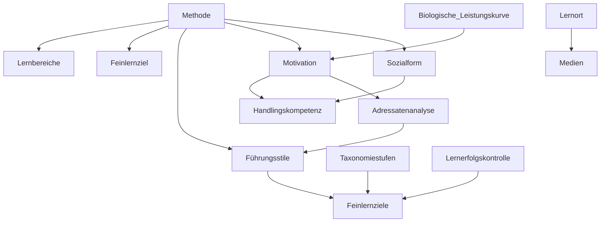

# Begriffe

etc.

TL&DR: Alles miteinander verbunden. Es gibt kein Schema für "immer erfolgreich"

# Zeugnis

Pflicht: Zahlen Daten Fakten (einfaches Zeugnis)

Auf Wunsch: Auch Erweitertes/Qualifiziertes Zeugnis mit Verhalten etc.

Wenn der Azubi nervt, ist es aber geschickt auf ZFD zurück zu fallen.

Man darf im Zeugnis nicht lügen. Ggf. etstehen dadurch regress-anforderungen von späteren Betrieben  wenn offensichtlich gelogen wurde.

Trotzdem soll das Zeugnis "wohlwollend" sein. Im allgemeinen abfuck

# Zulassung zur Prüfung

Siehe BBiG §37

Note: Sekundärliteratur DIHK und Uvers-Verlag

